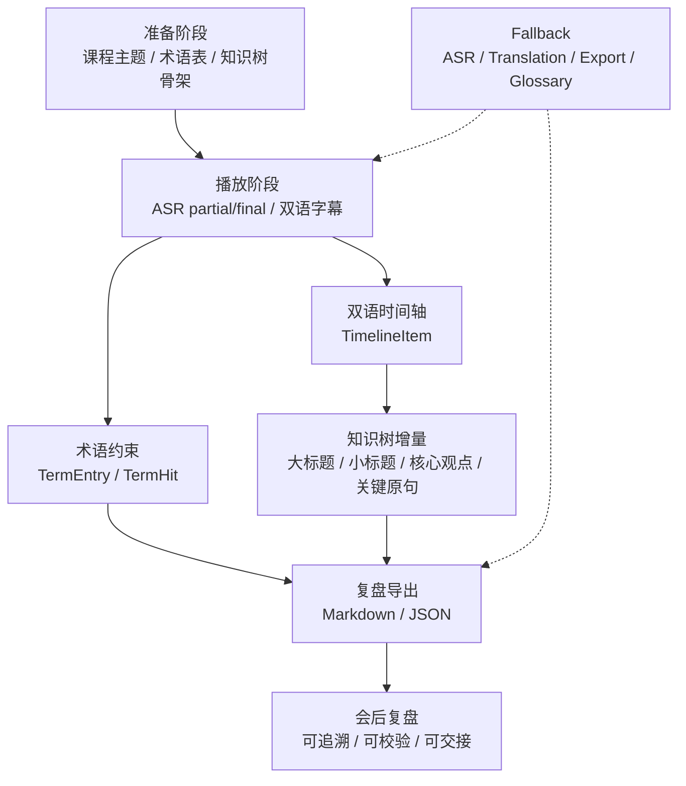

# 声济 SoundJi - Global AI Simultaneous Interpreter

声济 SoundJi 是一个面向英文技术分享、网课和跨语言会议准备场景的 AI 同声传译学习助手。当前版本先交付 P0 mock proof chain，用于证明“术语可控、状态可追踪、知识结构可沉淀、证据可复盘”的最小工程闭环。

当前仓库不是生产级同传应用：未接真实 ASR、真实 LLM/翻译模型、真实会议平台、TTS、多语种、API、数据库、前端或生产部署。系统知识树已有 P1 mock contract、校验和 transcript 输出，但真实生成能力尚未实现。

## 1. 当前结论

P0 证据链已经可复现：

```text
README
-> docs/ai_interpreter/01_technical_proposal.md
-> docs/ai_interpreter/02_architecture_design.md
-> docs/ai_interpreter/03_implementation_design.md
-> mock_data/ai_interpreter/*.json
-> scripts/validate_ai_interpreter_mock_data.py
-> scripts/run_ai_interpreter_mock_demo.py
-> outputs/ai_interpreter/transcript.md/json
-> deliverables/*.zip
```

P0 主链路：

```text
SampleStream
-> ASREvent partial/final
-> TermEntry / TermHit
-> TimelineItem
-> KnowledgeTree mock contract
-> Markdown / JSON ExportArtifact
-> FallbackMode visible notice
```

下一步如果继续开发，优先把 `KnowledgeTree` mock contract 做成可视化 demo，再做 P1 ASR/Translation adapter。不要直接承诺生产级同传、真实会议平台或完整实时自动回修。

## 2. 技术文档

核心文档：

| 文档 | 类型 | 回答的问题 |
|---|---|---|
| `README.md` | 项目入口与交接说明 | 当前交付是什么、如何运行、如何交接、PR 如何描述、哪些能力不能承诺 |
| `docs/ai_interpreter/01_technical_proposal.md` | 技术提案 | 为什么做、为谁做、痛点证据、竞品边界、替代方案和价值判断 |
| `docs/ai_interpreter/02_architecture_design.md` | 架构设计 | 系统如何分层、模块边界、mock/real 替换边界、数据流和控制流 |
| `docs/ai_interpreter/03_implementation_design.md` | 实现设计与 MVP 分析 | 对象、事件、状态、fallback、验收样例、72 小时计划和 P0/P1/P2 取舍 |

阅读顺序：

```text
README.md
-> 01_technical_proposal.md
-> 02_architecture_design.md
-> 03_implementation_design.md
-> run validation / runner
-> inspect transcript outputs
```

## 3. 产品闭环



系统知识树的目标形态：

```text
准备阶段
-> 生成课程知识树骨架：每个枝干是大标题
播放过程中
-> 根据 final 字幕和译文补充小标题
-> 写入核心内容和观点
-> 附带关键英文原句，便于回看与核对
复盘阶段
-> 与双语时间轴、术语命中、transcript 一起导出
```

知识树支持两种展示形态：

- 架构图：用图形结构展示 Root、Branch、Subtopic 的关系。
- 生长树：用类似代码目录树的白字结构展示 Root -> Branch -> Subtopic -> Core point -> Evidence quote -> Timeline ref。

桌面浮动设想：全屏视频左右出现黑框时，知识树以透明背景、白色等宽字体浮动在黑框区域；面板可拖动，随着视频进度向下生长，旧节点可以优先折叠核心观点，保留大标题和小标题。

## 4. P0/P1/P2 范围

```mermaid
flowchart LR
    subgraph P0["P0: 已有 mock proof chain"]
        P0A["SampleStream"]
        P0B["ASREvent partial/final"]
        P0C["TermEntry / TermHit"]
        P0D["TimelineItem"]
        P0E["Markdown / JSON transcript"]
        P0F["Validation + Runner"]
    end

    subgraph P1["P1: 下一步建议"]
        P1A["KnowledgeTree mock contract"]
        P1B["KnowledgeNode 引用校验"]
        P1C["ASR adapter contract"]
        P1D["Translation adapter contract"]
        P1E["Demo UI polish"]
    end

    subgraph P2["P2: 可砍/高风险"]
        P2A["真实 LLM 知识树生成"]
        P2B["可解释自动回修"]
        P2C["TTS 语音播报"]
        P2D["多语种/会议平台"]
    end

    P0 --> P1 --> P2
```



P0 验收口径：先证明"准备 - 准实时字幕 - 术语命中 - 双语时间轴 - 复盘导出"闭环可运行。真实 ASR、浏览器音频捕获、真实知识树生成和低延迟优化不能阻塞 P0。

## 4.5. 竞品与商业分析摘要

> 完整分析已整合至 `docs/ai_interpreter/01_technical_proposal.md` §4 和 §12，含波特五力逐力详析、SWOT 四象限战略推演、竞品双维能力矩阵、战略决策树与行动路线。

### 波特五力综合结论

| 竞争力 | 威胁等级 | 核心判断 |
|---|---|---|
| 替代品威胁 | 🔴 高 | 会议平台内置字幕已成标配，会议记录工具覆盖会后场景 |
| 现有竞争强度 | 🔴 高 | 四类竞品均成熟，但**无一家覆盖术语+状态+复盘完整学习闭环** |
| 供应商议价能力 | 🔴 中高 | MVP 阶段强依赖外部 ASR/LLM API |
| 新进入者威胁 | ⚠️ 中等 | 技术 API 门槛低，但领域深度需产品判断与工程积累 |
| 买方议价能力 | ⚠️ 中等 | 免费替代品多，但专业场景术语+复盘粘性高 |

### SWOT 战略策略

| 象限 | 策略 | 核心行动 |
|---|---|---|
| 🌟 SO 增长（优势×机会） | **主打** | 术语可控+学习化复盘闭环直击竞品盲区，切入在线教育场景 |
| ⚡ WO 扭转（劣势×机会） | 补充 | P1 接入真实 ASR/LLM adapter，先验证 EN→CN 单语对闭环 |
| ⚔️ ST 多元（优势×威胁） | 防守 | Mock/Real 可替换架构对抗供应商锁定；产品判断壁垒对抗大厂追赶 |
| 🛡️ WT 防御（劣势×威胁） | 止损 | 不正面竞争会议平台，聚焦学习型个人用户细分市场 |

### 竞品双维定位

SoundJi 是**唯一处于领导者象限**（会前准备强 + 会后复盘强）的产品：

- **高威胁**（🔴）：飞书妙记、Zoom/Teams/腾讯会议 — 复盘或分发渠道极强，若加术语功能将直接威胁
- **中威胁**（⚠️）：Otter、通义听悟 — 会后能力成熟，缺乏学习场景理解
- **低威胁**（🟢）：DeepL/Google、有道同传、Live Caption、字幕插件 — 非直接竞品

### 战略建议

**✅ 应该做**

| 事项 | 理由 |
|---|---|
| 锁定术语可控+状态稳定+复盘闭环差异定位 | 不与通用翻译或会议平台正面竞争 |
| 优先切入在线教育/技术分享场景 | 用 P0 mock 闭环验证价值假设 |
| 保持 Mock/Real 可替换架构 | 降低供应商依赖风险 |
| 在会前术语和会后复盘两个维度建立壁垒 | 竞品从任一端追来都需要时间 |

**❌ 战略红灯（绝对不做）**

通用实时翻译窗口 | 接入真实会议平台 | 商业同传 | 完整实时自动回修 | 实时 TTS | PDF/SRT/VTT 全格式导出

## 5. 本地运行方式

从仓库根目录运行：

```powershell
python ".\scripts\validate_ai_interpreter_mock_data.py"
python ".\scripts\run_ai_interpreter_mock_demo.py"
```

预期输出：

```text
AI interpreter mock data validation passed.
Summary: partials=10, finals=10, terms=10, timeline_items=10, knowledge_branches=5, knowledge_updates=10, fallbacks=asr/translation/export/glossary

AI interpreter mock demo transcript generated.
Summary: finals=10, glossary_entries=10, term_hits=13, knowledge_branches=5, knowledge_updates=10, ... optional_revision_demo_exists=true
```

生成物：

| 输出 | 说明 |
|---|---|
| `outputs/ai_interpreter/transcript.md` | Markdown 双语 transcript |
| `outputs/ai_interpreter/transcript.json` | JSON 双语 transcript |
| `outputs/ai_interpreter/floating_knowledge_tree_demo.html` | 可拖动白字知识树测试页，模拟全屏视频左右黑框中的自下往上生长效果 |
| `outputs/ai_interpreter/floating_real_text_tree_demo.html` | 真树形文字知识树测试页，使用树干、枝干和叶节点表达知识增长 |

## 6. 当前交付物

| 路径 | 用途 |
|---|---|
| `docs/ai_interpreter/01_technical_proposal.md` | 技术提案 |
| `docs/ai_interpreter/02_architecture_design.md` | 架构设计 |
| `docs/ai_interpreter/03_implementation_design.md` | 实现设计与 MVP 分析 |
| `mock_data/ai_interpreter/sample_stream.json` | 固定技术分享 mock stream |
| `mock_data/ai_interpreter/term_glossary.json` | 术语表 |
| `mock_data/ai_interpreter/expected_timeline.json` | 预期双语时间轴 |
| `mock_data/ai_interpreter/knowledge_tree.json` | P1 知识树 mock：初代大标题树、增量节点、浮动桌面视图 contract |
| `mock_data/ai_interpreter/fallback_examples.json` | 降级样例 |
| `scripts/validate_ai_interpreter_mock_data.py` | mock 数据契约校验 |
| `scripts/run_ai_interpreter_mock_demo.py` | 生成 transcript 的 P0 runner |
| `outputs/ai_interpreter/transcript.md` | Markdown 输出，包含 timeline、Knowledge Tree 架构图、生长树和增长快照 |
| `outputs/ai_interpreter/transcript.json` | JSON 输出，包含 timeline、knowledge_tree 和 growth_snapshots |
| `outputs/ai_interpreter/floating_knowledge_tree_demo.html` | 浮动知识树交互测试页，可拖动、可播放增长步骤 |
| `outputs/ai_interpreter/floating_real_text_tree_demo.html` | 真树形文字树交互测试页，可拖动、可播放树干分枝增长 |
| `deliverables/ai_interpreter_complete_demo_handoff_20260605_1705.zip` | 完整 demo handoff 包 |
| `deliverables/ai_interpreter_day1_pr_evidence_20260605_2306.zip` | Day 1 PR 证据包 |

## 7. 队友接手路径

1. 阅读 `README.md`，确认当前是 P0 mock proof chain。
2. 阅读 `docs/ai_interpreter/01_technical_proposal.md`，理解为什么做和为什么不做泛化同传平台。
3. 阅读 `docs/ai_interpreter/02_architecture_design.md`，理解模块边界和 mock/real 替换方式。
4. 阅读 `docs/ai_interpreter/03_implementation_design.md`，理解对象、事件、状态、验收样例和 72 小时 MVP 裁剪。
5. 运行 `scripts/validate_ai_interpreter_mock_data.py`。
6. 运行 `scripts/run_ai_interpreter_mock_demo.py`。
7. 查看 `outputs/ai_interpreter/transcript.md` 和 `outputs/ai_interpreter/transcript.json`。
8. 若继续开发，优先把浮动知识树做成可拖动 UI 或继续拆 P1 adapter 边界，不直接承诺生产同传。

可直接发给队友的话术：

```text
这是 SoundJi AI 同声传译助手的 Day 1 P0/P1 mock 交接包，不是生产应用。请先读 README.md，再读 docs/ai_interpreter/01_technical_proposal.md、02_architecture_design.md、03_implementation_design.md；然后运行 scripts/validate_ai_interpreter_mock_data.py 与 scripts/run_ai_interpreter_mock_demo.py，最后查看 outputs/ai_interpreter/transcript.md / transcript.json。当前证明的是"术语可控、状态可追踪、证据可复盘"的最小闭环；系统知识树已有 mock 数据、引用校验和输出样例，但还没有真实生成实现，不证明真实 ASR/LLM 或会议平台接入。
```

## 8. Day 1 PR 描述模板

````markdown
## 功能描述
本 PR 初始化 AI 同声传译助手 Day 1 工程证据包，包含 README、三份设计文档、P0 mock 数据、校验脚本、mock runner 和 transcript 输出。用户可以通过两个 Python 命令复现 P0 mock proof chain。

## 实现思路
本 PR 不接真实 ASR/LLM，不做生产 API/DB/前端。先用 mock/real 可替换边界证明最小闭环：SampleStream -> ASREvent partial/final -> TimelineItem -> Markdown/JSON ExportArtifact。设计遵循 XEngineer/ZGC 的产品减法、架构乘法、测试证据原则。

新增系统知识树已作为 P1 mock contract 记录：准备阶段生成大标题树，播放过程中按 final 字幕补充小标题、核心观点和关键原句，并在 transcript 中输出架构图、生长树和增长快照。当前 PR 不声称已经实现真实知识树自动生成。

## 测试方式
```powershell
python ".\scripts\validate_ai_interpreter_mock_data.py"
python ".\scripts\run_ai_interpreter_mock_demo.py"
```

## 备注
当前是 P0 mock proof chain，不是生产应用。未接真实 ASR、真实 LLM/翻译模型、会议平台、TTS、多语种、API、数据库或前端。当前未复用个人历史代码；若后续复用，必须在对应 PR 描述中注明来源。
````

建议 commit：

```text
docs: initialize day1 evidence package
```

后续 PR 拆分：

| PR | 目标 | 范围 |
|---|---|---|
| PR 1 | Day 1 工程证据包 | README、三份设计文档、mock 数据、脚本、transcript |
| PR 2 | Floating KnowledgeTree UI | 把 `knowledge_tree.json` 和 growth snapshots 渲染成可拖动白字树 |
| PR 3 | P1 ASR adapter 边界 | 只定义输入输出和错误状态，不接真实 SDK |
| PR 4 | P1 Translation adapter 边界 | 只定义结构化结果和 fallback，不承诺模型质量 |
| PR 5 | Demo polish | README、demo 脚本、录屏链接、已知限制 |

## 9. XEngineer/ZGC 工程判断

本项目遵循：

```text
产品做减法，架构做乘法，测试做证明，AI 做加速，人做判断。
```

| 判断 | Day 1 落实 |
|---|---|
| 产品做减法 | 不做泛化同传平台，只做技术分享 P0 mock 闭环 |
| 架构做乘法 | 所有能力放在 ASR/Translation/Terminology/Timeline/Export/Fallback 边界后 |
| 测试做证明 | 使用 validation、runner、transcript 和 zip 证明可复现 |
| AI 做加速 | AI 用于研究、文档、数据、脚本和红队审查 |
| 人做判断 | 明确 P0/P1/P2、非目标、风险和真实能力边界 |
| 学习结构做约束 | 系统知识树必须绑定关键原句和时间轴引用，不能无引用自动总结 |

来源分级：

```text
Q1: 七牛云官方来源
G1: GitHub 官方仓库 README/docs/source
L1: 本地课程资料
O1: 官方产品资料
U1/U2/U3: 用户评论或用户证据
S1/S2: 二手资料
I: 推断或项目内判断
```

## 10. 项目结构

```text
.
├── README.md
├── docs/
│   └── ai_interpreter/
│       ├── 01_technical_proposal.md
│       ├── 02_architecture_design.md
│       └── 03_implementation_design.md
├── mock_data/
│   └── ai_interpreter/
│       ├── sample_stream.json
│       ├── term_glossary.json
│       ├── expected_timeline.json
│       ├── knowledge_tree.json
│       └── fallback_examples.json
├── scripts/
│   ├── validate_ai_interpreter_mock_data.py
│   └── run_ai_interpreter_mock_demo.py
├── outputs/
│   └── ai_interpreter/
│       ├── transcript.md
│       ├── transcript.json
│       ├── floating_knowledge_tree_demo.html
│       └── floating_real_text_tree_demo.html
└── deliverables/
    ├── ai_interpreter_complete_demo_handoff_20260605_1705.zip
    └── ai_interpreter_day1_pr_evidence_20260605_2306.zip
```

## 11. 已知限制

- 当前是 P0 mock proof chain，不是生产应用。
- 未接真实 ASR。
- 未接真实 LLM 或翻译模型。
- 未接真实会议平台。
- 未实现 TTS、多语种、API、数据库或前端。
- 未实现真实系统知识树生成；当前完成的是 P1 mock contract、引用校验和输出样例。
- 未证明生产级低延迟。
- `RevisionDemoEvent` 是 P2 demo-only，不进入主 timeline。
- 如复用历史代码，必须在 PR 描述中注明来源。
- 如引入第三方依赖，必须在 README 和 PR 描述中列明。
