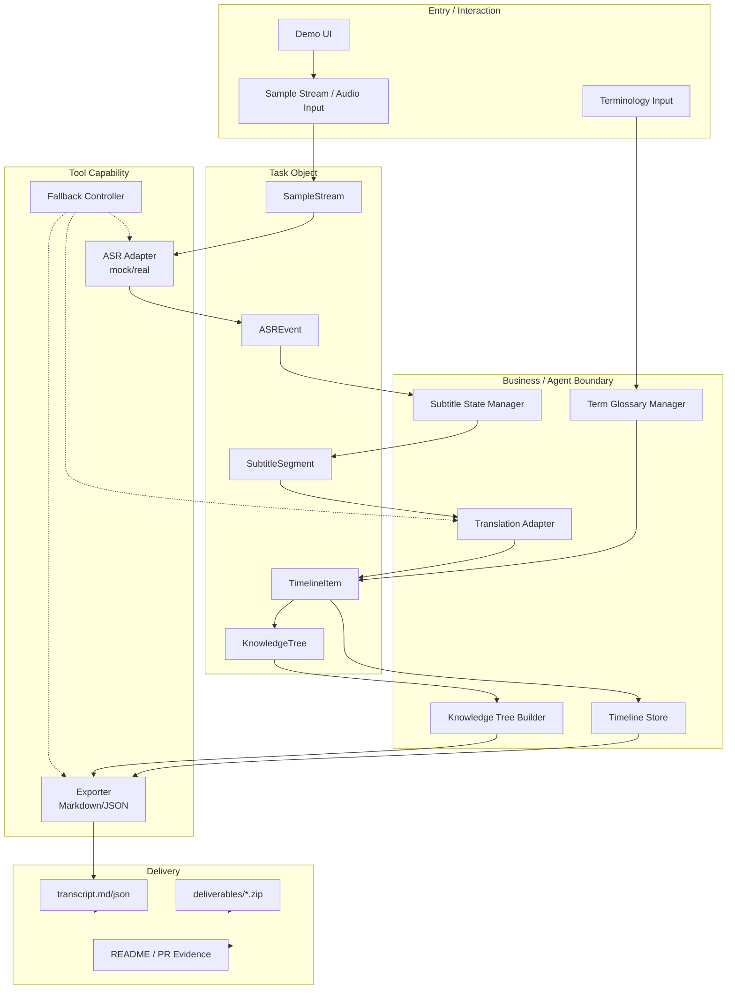
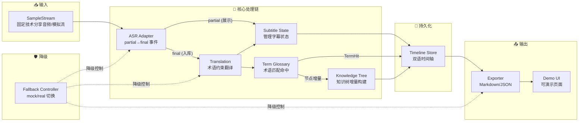
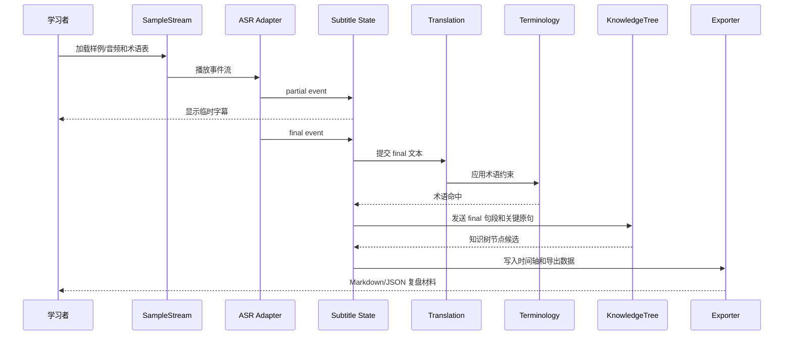

# AI 同声传译助手架构设计

版本：v0.2

本文档属于架构设计，回答的是：系统整体怎么组织，组件边界是什么，数据流和控制流如何协作，如何满足可用性、扩展性、安全性和可维护性。它不展开具体 API 字段细节，具体落地进入实现设计。

本文承接技术提案的 Why / Whether 结论，只处理 System How：

- 不再论证赛题是否值得做。
- 不把外部技术参考和用户证据写成实现细节。
- 不定义最终 API 字段、表结构和测试用例细节。
- 只固定组件、职责边界、数据流、控制流、部署形态和治理约束。

## 1. 架构目标

系统目标是构建一个面向学习场景的实时传译工作台，而不是单一字幕组件。架构需要同时支持：

- 实时/准实时字幕生成。
- 术语约束和上下文注入。
- 原文、译文、术语命中和时间轴的可追溯保存。
- 系统知识树的准备期生成和播放期增量补全。
- 会后 Markdown/JSON 复盘导出。
- mock/real 引擎切换，便于测试和演示。

## 2. 架构原则

| 原则 | 说明 |
|---|---|
| 分层边界清晰 | 输入、ASR 事件、字幕状态、翻译、术语、时间轴、知识树、导出、降级分开，避免模型调用散落。 |
| 数据对象优先 | 显式定义 SampleStream、ASREvent、TermEntry、TermHit、TimelineItem、KnowledgeTree、ExportArtifact、FallbackMode。 |
| 状态可追踪 | 字幕分为 partial 和 final；P2 回修样例只能作为额外演示记录，避免 UI 误把临时结果当最终结果。 |
| 工具可替换 | ASR、LLM、导出器都通过统一接口切换 mock/real。 |
| 证据可审计 | 每次识别、翻译、术语命中和导出都记录来源、时间和引擎。 |
| MVP 可纵切 | 先跑通单用户单音频主链路，再扩展多人会议或直播。 |

## 3. 总体架构

本节只描述 P0 最小模块边界，不画完整服务链。P0 主链路为：

```text
Demo Input / Sample Stream
  -> ASR Event Adapter
  -> Subtitle State Manager
  -> Translation Adapter
  -> Term Glossary / Hotword Manager
  -> Timeline Store
  -> Knowledge Tree Builder
  -> Exporter
  -> Demo UI
  -> Fallback Controller
```

完整的 App API、Session Service、Agent Runtime、API Gateway、关系型数据库和对象存储只属于未来演进，不作为 72 小时 MVP 的 P0 推荐。

### 3.1 架构总览图



## 4. 分层架构

### 4.1 Product 层

| 内容 | 决策 |
|---|---|
| 目标用户 | 个人学习者、技术从业者、跨语言培训参与者。 |
| 主场景 | 英文网课/技术分享的实时理解和会后复盘。 |
| MVP | 单用户固定音频或模拟流，生成双语时间轴、术语命中和 Markdown/JSON 导出；知识树先定义 contract 和 mock 样例。 |
| 非目标 | 大型会议平台、商业活动同传、实时配音、多用户协同。 |
| 成功指标 | 可运行、可追溯、可导出、可解释、有测试和 demo。 |

### 4.2 Interaction 层

入口包括：

- 音频文件上传。
- 课程主题和术语表输入。
- 实时字幕视图。
- 知识树视图：准备阶段展示大标题树，播放过程中增量补充小标题、核心观点和关键原句。
- 浮动知识树视图：全屏视频左右黑框区域显示透明背景白字树，支持拖动、左右锚点切换和纵向增长。
- 会后复盘视图。
- 导出按钮。

MVP 不要求浏览器系统音频捕获。若后续支持浏览器捕获，应作为单独技术提案，因为它涉及权限、兼容性和隐私边界。

### 4.3 Business 层

业务层在 P0 中只负责把用户操作组织成逻辑动作，不定义具体 API 路径、Session 服务或持久化运行系统：

```text
加载样例输入
  -> 加载术语上下文
  -> 开始传译演示
  -> 生成字幕片段
  -> 翻译 final 片段
  -> 匹配术语
  -> 更新知识树节点
  -> 生成时间轴材料
  -> 导出复盘结果
```

业务层不直接散落调用模型，而是通过 Adapter 完成翻译和降级。真实 Session/Run 管理属于后续实现阶段。

### 4.4 Agent 层

Agent 层降级为 P1/P2 可选智能层，不进入 P0 主链路。P0 包含 `Translation Adapter`、术语约束、字幕状态、时间轴、导出和 fallback。

| Agent 能力 | 输入 | 输出 |
|---|---|---|
| Prompt Assembler | final segment、术语表、上下文 | P1 可选翻译提示上下文 |
| Translation Agent | 原文片段、术语约束 | P1 可选译文、置信度、风险标签 |
| Review Agent | 全量时间轴、术语命中 | P2 可选摘要、学习重点、疑点清单 |
| Knowledge Tree Agent | 课程主题、术语表、final 句段、关键原句 | P1/P2 可选知识树骨架和增量节点 |
| P2 Revision Demo | 伪数据、术语命中原因 | 前后文本、修正原因 |

Agent/Gateway 不作为 P0 必做能力。若后续接入智能层，必须返回结构化结果，并由业务模块校验后写入时间轴或知识树，不能直接写库。

### 4.5 Tool / Adapter 层

| 工具/适配器 | 职责 | MVP 实现 |
|---|---|---|
| ASR Adapter | 音频转原文字幕 | mock + 可替换真实 ASR |
| Translation Adapter | 原文转中文译文 | LLM 或 mock translator |
| Term Tool | 术语表查询和命中 | 本地词表匹配 |
| Knowledge Tree Tool | 生成课程知识树骨架和增量节点 | mock JSON 或规则样例，P1/P2 再接 LLM |
| P2 Revision Tool | 生成一条可解释回修样例 | 伪数据或规则 mock，不进 P0 主链路 |
| Export Tool | 导出 Markdown/JSON | 本地文本或文件生成 |

工具必须声明超时、失败模式和结构化返回。

### 4.6 最小系统边界

| 模块 | 负责 | 不负责 | 输入 | 输出 | 失败/降级策略 | 评审可见证据 |
|---|---|---|---|---|---|---|
| Demo Input / Sample Stream | 提供固定英文技术分享音频或模拟流 | 不接真实会议平台、不处理多路音频 | 样例音频、预置文本事件 | 音频片段或模拟 ASR 事件 | 无音频时直接播放预置事件 | 样例输入文件/事件流截图 |
| ASR Event Adapter | 把输入转成 partial/final 文本事件 | 不做业务翻译、不做术语修正 | 音频片段或预置事件 | ASR 文本、时间戳、partial/final 状态 | 真实 ASR 失败则切模拟事件 | partial/final 流式展示录屏 |
| Subtitle State Manager | 管理字幕显示状态和 final 入库 | 不负责翻译质量、不负责导出格式 | ASR 事件、翻译结果、术语命中 | 当前字幕状态、final 字幕记录 | 只展示 final，关闭 partial 动画 | 字幕状态截图、时间轴列表 |
| Translation Adapter | 将 final 英文转为中文 | 不做 ASR、不维护术语库本体 | final 英文、术语约束 | 中文译文、翻译状态 | 翻译失败则使用预置译文 | 中英双语字幕截图 |
| Term Glossary / Hotword Manager | 导入、保存、匹配术语/热词 | 不保证解决所有错译、不做团队权限 | CSV/JSON/内置术语表、ASR/译文文本 | 术语命中、推荐译法、命中高亮 | 导入失败则使用内置术语表 | 术语表、命中高亮、命中统计 |
| Timeline Store | 保存 final 双语句段和术语命中 | 不做长期云存储、不做用户账户 | final 英文、中文译文、时间戳、术语命中 | 双语时间轴记录 | 内存保存；失败则页面可复制 | 时间轴截图 |
| Knowledge Tree Builder | 生成和增量更新课程知识树 | 不做无引用自动总结、不替代原文字幕 | 课程主题、术语表、final 句段、译文、时间轴 | 大标题、小标题、核心观点、关键原句、时间轴引用 | 生成失败则只展示时间轴和术语命中 | 知识树 mock 样例、节点引用截图 |
| Exporter | 导出 Markdown/JSON transcript | 不做 PDF/SRT/VTT/云同步 | 时间轴记录、术语命中、知识树 | Markdown/JSON 文本或文件 | 文件导出失败则展示可复制文本 | 导出样例截图/文件内容 |
| Demo UI | 展示导入、字幕、状态、时间轴、导出 | 不承诺生产级交互、多端适配 | 模块状态、事件、时间轴 | 可演示页面 | 简化为单页 demo | 3 分钟端到端录屏 |
| Fallback Controller | 控制 mock/real 切换和失败降级 | 不修复模型质量、不隐藏 mock 边界 | ASR/翻译/导出错误状态 | 降级模式、提示信息 | 切预置 ASR、预置译文、可复制导出 | 降级说明和 fallback 演示 |
| P2 Revision Demo | 可选展示一条解释性回修样例 | 不进入主链路、不承诺实时自动回修 | 伪数据、术语命中原因 | 前后文本、修正原因 | 砍掉或口头说明 | 标注为 P2 的演示截图 |

### 4.7 Domain / Data 层

核心对象：

| 对象 | 含义 |
|---|---|
| SampleStream | 固定技术分享输入或模拟流。 |
| ASREvent | ASR partial/final 输出事件。 |
| SubtitleSegment | 字幕片段，包含时间轴、原文和状态。 |
| TranslationResult | final 字幕对应的中文译文和状态。 |
| TermEntry | 术语、译名、别名和类别。 |
| TermHit | 一次术语命中及其位置。 |
| TimelineItem | 会后复盘时间轴条目。 |
| KnowledgeTree | 课程知识树，包含大标题、小标题、核心观点、关键原句和时间轴引用。 |
| KnowledgeNode | 知识树节点，可表示大标题、小标题或核心观点。 |
| KnowledgeTreeUpdate | 一次随时间轴发生的知识树增长事件，绑定 segment、节点、核心观点和关键原句。 |
| FloatingKnowledgeTreeView | 知识树桌面浮动视图 contract，包含展示模式、锚点、拖动、字体和折叠策略。 |
| ExportArtifact | Markdown/JSON 导出材料。 |
| FallbackMode | 降级模式、原因和可见提示。 |
| RevisionDemoEvent | P2 可选伪数据回修演示，不进入 P0 主链路。 |

### 4.8 Governance 层

治理边界：

- 音频和转写内容默认属于用户私有数据。
- 导出前显示敏感信息提示。
- 自动回修不进入 P0 主链路；P2 样例必须标注为 demo，不覆盖原文。
- 知识树节点必须保留来源原句和时间轴引用，避免模型把推断包装成课程原文。
- 低置信度内容必须标记。
- 工具调用记录 trace，便于复盘和 debug。
- MVP 不采集用户内容训练模型。

### 4.9 Verification 层

验证对象：

- 单元测试：术语命中、状态流转、导出格式。
- 集成测试：样例音频或 mock 音频到 Markdown 导出。
- Trace 检查：每个 final Segment 有来源、状态、译文和术语命中。
- KnowledgeTree 检查：每个新增知识节点至少关联一个 final 片段或关键原句。
- FloatingKnowledgeTreeView 检查：必须声明 `architecture_graph` 和 `growing_code_tree` 两种展示模式，且 `floating`、`draggable` 为 true。
- 人工验收：用一段 3-5 分钟技术分享音频完成 demo。

### 4.10 XEngineer 六层全景架构

```mermaid
flowchart TB
    subgraph L1["🔝 Product 层 — 产品定位与用户场景"]
        direction LR
        P1["目标用户：学习者/技术从业者"]
        P2["主场景：英文网课/技术分享"]
        P3["MVP：单用户 Mock 闭环"]
    end
    subgraph L2["🖥️ Interaction 层 — 交互入口"]
        direction LR
        I1["音频文件上传"]
        I2["术语表/热词导入"]
        I3["实时字幕视图"]
        I4["知识树视图"]
        I5["复盘导出面板"]
    end
    subgraph L3["⚙️ Business 层 — 业务编排"]
        direction LR
        B1["加载样例输入"]
        B2["术语上下文加载"]
        B3["传译演示调度"]
        B4["字幕片段生成"]
        B5["术语匹配与命中"]
    end
    subgraph L4["🧠 Agent 层 (P1/P2 可选)"]
        direction LR
        A1["Prompt Assembler"]
        A2["Translation Agent"]
        A3["Review Agent"]
        A4["Knowledge Tree Agent"]
    end
    subgraph L5["🔧 Tool / Adapter 层 — 工具抽象"]
        direction LR
        T1["ASR Adapter (mock/real 切换)"]
        T2["Translation Adapter (术语约束)"]
        T3["Term Tool (词表查询命中)"]
        T4["Export Tool (Markdown/JSON)"]
        T5["Knowledge Tree Tool"]
        T6["Fallback Controller (降级)"]
    end
    subgraph L6["💾 Domain / Data 层 — 核心数据对象"]
        direction LR
        D1["SampleStream"]
        D2["ASREvent"]
        D3["SubtitleSegment"]
        D4["TranslationResult"]
        D5["TermEntry / TermHit"]
        D6["TimelineItem"]
        D7["ExportArtifact"]
    end
    L1 --> L2 --> L3 --> L5 --> L6
    L3 -.->|"P1/P2 可选"| L4
    L4 -.->|"结构化结果"| L5
```



层间关系说明：

```
Product 层（为什么做）
  → 约束
Interaction 层（用户怎么用）
  → 驱动
Business 层（系统怎么编排）
  → 调用                    ↖ P1/P2 可选增强
Tool / Adapter 层（怎么实现）  ←  Agent 层（智能增强）
  → 持久化
Domain / Data 层（怎么定义）
```

### 4.11 P0 最小系统模块边界图



### 4.12 Delivery 层

交付物：

- 运行命令。
- 样例输入。
- 样例输出 Markdown/JSON。
- 架构图。
- Demo script。
- 已知限制。
- 证据等级说明。

## 5. 证据到架构的映射

技术提案中的证据不直接决定模型选型，而是约束架构必须保留哪些能力边界：

| 证据/机会 | 架构响应 | 不在架构层承诺 |
|---|---|---|
| 术语/专名错译有中等强度信号 | 独立 Terminology Service，并在翻译和术语命中链路中复用。 | 不承诺术语一定识别正确。 |
| 会后可追溯/可下载/可恢复是较强机会 | Artifact Store 和 Export Service 成为主链路，不作为附属功能。 | 不承诺替代会议纪要产品。 |
| 网课/技术分享学习节奏存在中等机会 | Product 层固定个人学习者和课程/技术分享场景。 | 不承诺覆盖所有直播/会议场景。 |
| 技术学习者需要系统知识树是新增项目内需求 | 增加 Knowledge Tree Builder/Store，节点必须引用原句和时间轴。 | 不承诺 P0 已实现真实知识树自动生成。 |
| 前文自动回修证据弱但差异化强 | 只作为 P2 Revision Demo，主链路不依赖。 | 不承诺完整实时自动回修。 |
| 官方产品已覆盖部分字幕/纪要能力 | 架构聚焦术语、字幕状态和复盘的组合工作流。 | 不做泛字幕窗口或泛会议平台。 |

## 6. 控制流

P0 控制流只使用逻辑动作，不绑定具体 API endpoint：

```text
用户加载音频/模拟流和术语表
  -> 系统生成 SampleStream/TermEntry
  -> 用户开始传译演示
  -> ASR Event Adapter 产生 partial/final 事件
  -> Subtitle State Manager 展示 current 并提交 final
  -> Translation Adapter 翻译 final 片段
  -> Term Glossary / Hotword Manager 生成 TermHit
  -> Knowledge Tree Builder 根据 final 片段补充知识节点
  -> Timeline Store 保存 TimelineItem
  -> Exporter 生成 Markdown/JSON transcript 和可选 KnowledgeTree
```

### 6.1 控制流图



## 7. 数据流

```text
Audio bytes
  -> chunks
  -> ASR partial segments
  -> ASR final segments
  -> translation candidates
  -> terminology matches
  -> knowledge tree updates
  -> confirmed timeline
  -> review artifact
```

关键设计：只有 final segment 进入翻译、术语命中和复盘主链路，partial segment 只用于实时显示。这样可以降低字幕反复变化对用户理解的干扰。

mock/real 替换边界：

| 能力 | MVP mock | 可替换 real 边界 |
|---|---|---|
| ASR | 预置 partial/final 事件流 | 替换为真实 ASR，只要输出同样的文本、时间戳和状态。 |
| 翻译 | 预置译文或简单翻译结果 | 替换为真实翻译服务，只要输入 final 英文和术语约束。 |
| 术语表 | 内置或手动导入小表 | 替换为真实词库/热词服务。 |
| 时间轴 | 内存或本地状态 | 替换为数据库/文件存储。 |
| 知识树 | 预置骨架和增量节点 mock | 替换为真实 LLM 结构化生成，只要输出 KnowledgeTree schema 且保留原句引用。 |
| 浮动知识树视图 | 白字等宽文本树和 Mermaid 架构图 | 替换为桌面悬浮窗或 Web overlay，只要不遮挡视频主体、可拖动、可折叠。 |
| 导出 | Markdown/JSON 文本 | 后续再扩展 SRT/VTT/PDF。 |
| 回修 | P2 伪数据 | 只有证据和实现能力补足后，才能进入真实回修链路。 |

## 8. 部署拓扑

MVP 推荐单机演示形态，但不在架构设计中绑定 FastAPI、Node、SQLite 或 JSONL。实现阶段可以按团队熟悉度选择最小可运行形态，只要满足对象、事件、状态和验收样例。

后续可演进为候选服务链：

```text
Web UI
  -> API Gateway
  -> Session Service
  -> Streaming Worker
  -> Agent Runtime
  -> Object Storage
  -> Relational DB
```

## 9. 关键架构决策

| 决策 | 选择 | 理由 |
|---|---|---|
| 输入方式 | 先文件上传/模拟流 | 降低浏览器捕获和系统音频权限复杂度。 |
| 字幕状态 | partial/final | 对应实时 ASR 的不稳定性，避免把临时字幕写入最终复盘。 |
| 回修策略 | P2 optional，只追加演示记录，不覆盖主时间轴 | 用户证据和 72 小时实现风险都不足以支撑 P0 自动回修。 |
| 存储 | MVP 只要求可保存时间轴状态和导出材料 | 具体采用内存、文件或数据库由真实实现阶段决定。 |
| 引擎 | mock/real 可切换 | 课程材料强调接口稳定，便于测试和演示。 |
| Agent 写入 | P0 不引入 Agent 写入 | 后续若引入 Agent，只返回结构化结果，由业务层校验和保存。 |
| 知识树更新 | P1/P2 引入，不阻塞 P0 | 系统知识树对学习价值很强，但必须先通过 mock contract 和引用校验证明不会误导。 |
| 知识树展示 | 架构图 + 生长树双模式 | 架构图便于讲解结构，生长树适合全屏视频黑框中的白字浮动显示。 |

## 10. 架构风险

| 风险 | 架构缓解 |
|---|---|
| 实时链路复杂导致不可跑 | MVP 改为准实时 chunk pipeline。 |
| 模型输出不稳定 | 使用 schema 校验、置信度和 fallback。 |
| 知识树节点误导用户 | 节点必须绑定关键原句、时间段和来源类型；低置信节点标记为待确认。 |
| 浮动树遮挡视频内容 | 默认锚定左右黑框区域；支持拖动；树过高时优先折叠旧 core point，保留大标题和小标题。 |
| 自动回修链路难证明 | 移出 P0 主链路，作为 P2 标注 demo。 |
| 现有方案已有字幕/纪要 | 架构突出术语、状态稳定和双语复盘，而非泛纪要。 |
| 数据隐私 | 本地样例、用户主动上传、可删除、不训练。 |

## 11. 与实现设计的边界

本架构设计规定组件、边界、控制流、数据流和治理要求。实现设计负责对象、事件、状态、验收样例。以下内容等进入真实实现阶段后再定义：

- API 路径和字段。
- 数据表字段。
- 状态机转移。
- 错误码。
- 测试用例。
- 模块级伪代码。
