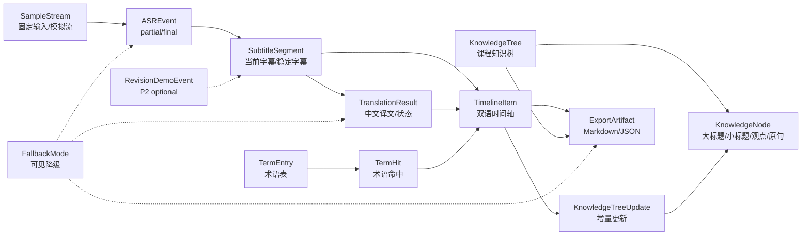
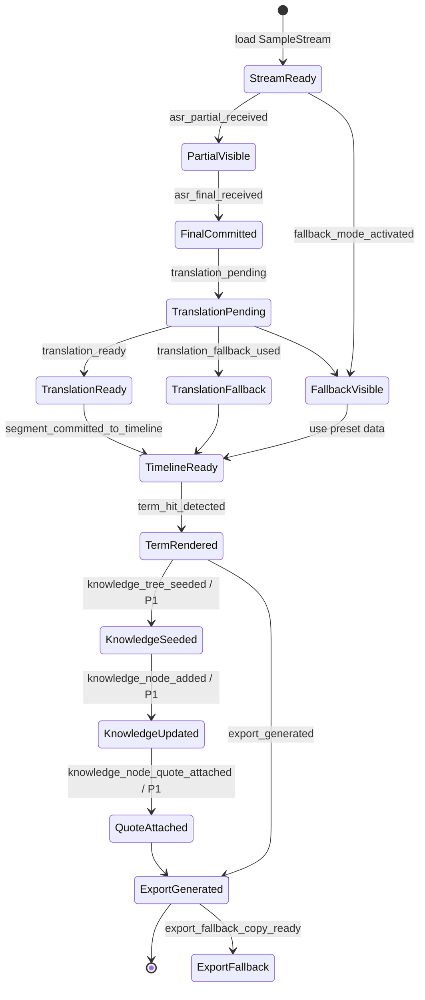
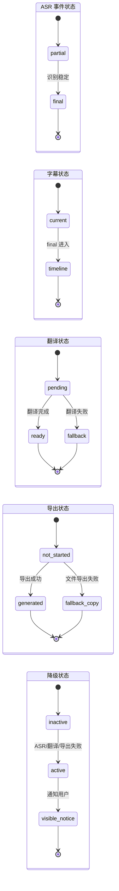
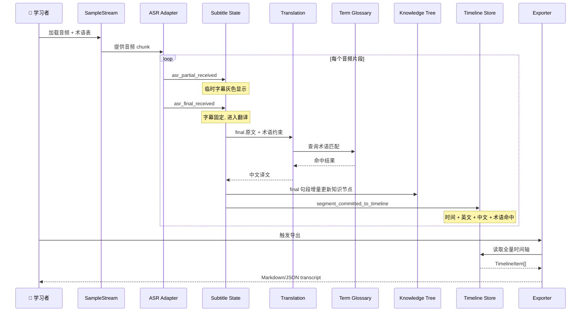
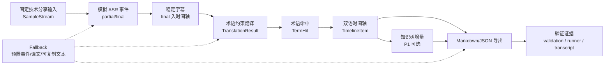
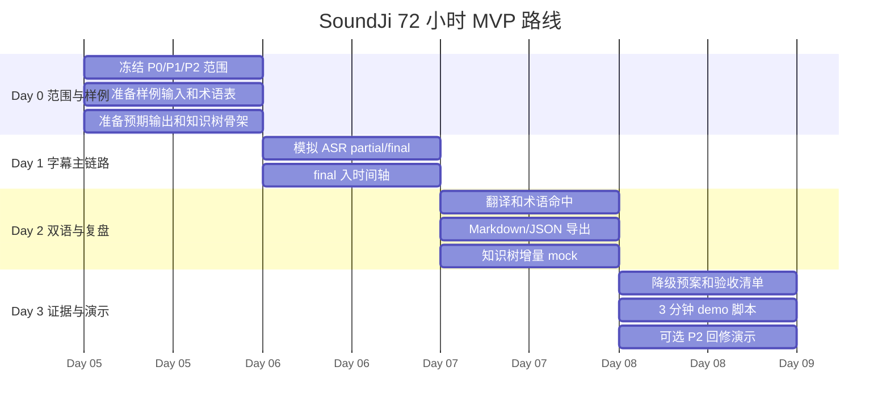
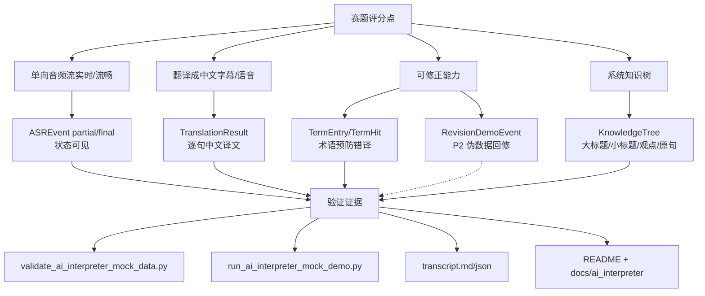

# AI 同声传译助手实现设计

版本：v0.2

本文档属于实现设计，回答的是：模块具体落地前，需要先锁定哪些对象、事件、状态流转和验收样例。当前版本是实现设计前置契约，不写代码，不写具体接口端点，不写数据库表结构，不绑定技术栈。

本文承接技术提案和架构设计：

- 不重新论证项目为什么值得做。
- 不改变架构设计中的最小系统边界。
- 不新增产品范围。
- 不把 P2 自动回修写入 P0 主链路。
- 不把真实知识树自动生成写成 P0 已实现能力；当前先定义对象、事件和验收样例。
- 不定义会议平台接入、多用户权限、生产级监控或完整导出生态。

## 1. 实现边界

P0 主链路只覆盖：

```text
SampleStream
  -> ASREvent partial/final
  -> SubtitleSegment current/timeline
  -> TranslationResult
  -> TermHit
  -> TimelineItem
  -> KnowledgeTree / KnowledgeNode
  -> ExportArtifact Markdown/JSON
  -> FallbackMode visible notice
```

P2 optional 只允许存在一个 `RevisionDemoEvent`，用于展示伪数据回修方向。它不是实时自动回修系统，也不能阻塞 P0 演示。

知识树能力当前定位为 P1 contract / P2 智能生成候选：准备阶段生成大标题树，播放过程中根据 final 句段逐步补充小标题、核心观点和关键原句。若 P0 资源不足，先使用 mock 数据和 schema，不进入 runner 主链路。

### 1.1 对象关系图



读图口径：P0 的硬闭环是 `SampleStream -> ASREvent -> SubtitleSegment -> TimelineItem -> ExportArtifact`；术语、翻译和 fallback 是 P0 增强；知识树是 P1 contract；`RevisionDemoEvent` 只能作为 P2 伪数据演示。

### 1.2 KnowledgeTree 结构约束

知识树必须按以下层级组织，不能退化成普通摘要：

```text
Root: 课程主题
Branch: 大标题
Subtopic: 小标题
Core point: 核心观点
Evidence quote: 关键英文原句
Timeline ref: 对应字幕时间段
```

两种展示模式：

- `architecture_graph`：类似架构图，展示 Root、Branch、Subtopic 的结构关系。
- `growing_code_tree`：类似代码目录树，准备阶段只有 Root 和 Branch，播放过程中逐步向下长出 Subtopic、Core point、Evidence quote 和 Timeline ref。

浮动桌面视图 contract：

```text
FloatingKnowledgeTreeView
  -> transparent background
  -> white monospace text
  -> draggable
  -> default_anchor: right_black_bar
  -> alternate_anchor: left_black_bar
  -> growth_direction: vertical_down
  -> collapse_strategy: collapse_old_core_points_first
```

黑框承载假设：当视频全屏后左右出现图幅比例不匹配产生的黑框，浮动白字知识树优先占据黑框区域，避免遮挡视频主体内容。

## 2. 最小数据对象契约

| 对象 | 用途 | 关键字段名 | 生产模块 | 消费模块 | 验收样例 |
|---|---|---|---|---|---|
| `SampleStream` | 表示固定技术分享输入或模拟流 | `stream_id`, `title`, `mode`, `events`, `duration_ms` | Demo Input / Sample Stream | ASR Event Adapter, Demo UI | `D0_SAMPLE_STREAM_READY` |
| `ASREvent` | 表示 ASR 输出事件 | `event_id`, `stream_id`, `ts_ms`, `text`, `status`, `sequence` | ASR Event Adapter | Subtitle State Manager | `D1_ASR_PARTIAL_FINAL_FLOW` |
| `TermEntry` | 表示术语/热词条目 | `term_id`, `source_text`, `target_text`, `aliases`, `category` | Term Glossary / Hotword Manager | Translation Adapter, Subtitle State Manager | `D0_TERM_GLOSSARY_READY` |
| `TermHit` | 表示一次术语命中 | `hit_id`, `term_id`, `segment_id`, `source_text`, `target_text`, `position` | Term Glossary / Hotword Manager | Demo UI, Timeline Store, Exporter | `D2_TERM_HIT_HIGHLIGHT` |
| `SubtitleSegment` | 表示字幕片段 | `segment_id`, `stream_id`, `start_ms`, `end_ms`, `source_text`, `status` | Subtitle State Manager | Translation Adapter, Timeline Store, Demo UI | `D1_FINAL_SEGMENT_TO_TIMELINE` |
| `TranslationResult` | 表示翻译结果 | `translation_id`, `segment_id`, `target_text`, `status`, `used_terms` | Translation Adapter | Subtitle State Manager, Timeline Store, Demo UI | `D2_TRANSLATION_READY` |
| `TimelineItem` | 表示会后复盘时间轴条目 | `item_id`, `segment_id`, `start_ms`, `end_ms`, `source_text`, `target_text`, `term_hits` | Timeline Store | Demo UI, Exporter | `D2_BILINGUAL_TIMELINE_READY` |
| `KnowledgeTree` | 表示课程系统知识树 | `tree_id`, `root_title`, `phase`, `nodes`, `source_refs`, `status` | Knowledge Tree Builder | Demo UI, Exporter | `D2_KNOWLEDGE_TREE_DRAFT_READY` |
| `KnowledgeNode` | 表示知识树节点 | `node_id`, `parent_id`, `level`, `title`, `core_points`, `source_quotes`, `timeline_refs` | Knowledge Tree Builder | Demo UI, Exporter | `D2_KNOWLEDGE_TREE_INCREMENTAL_UPDATE` |
| `KnowledgeTreeUpdate` | 表示一次增量补全 | `update_id`, `tree_id`, `segment_id`, `operation`, `node_id`, `reason`, `is_model_generated` | Knowledge Tree Builder | Demo UI, Trace / Exporter | `D2_KNOWLEDGE_TREE_SOURCE_LINKED` |
| `FloatingKnowledgeTreeView` | 表示桌面浮动知识树视图 | `view_id`, `display_modes`, `desktop_behavior`, `default_anchor`, `growth_direction` | Demo UI / Overlay | Demo UI, Exporter | `D2_FLOATING_TREE_VIEW_READY` |
| `ExportArtifact` | 表示导出结果 | `artifact_id`, `format`, `content`, `status`, `created_at` | Exporter | Demo UI, Fallback Controller | `D2_EXPORT_MARKDOWN_JSON` |
| `FallbackMode` | 表示降级模式 | `mode_id`, `reason`, `active`, `fallback_source`, `visible_notice` | Fallback Controller | Demo UI, ASR Event Adapter, Translation Adapter, Exporter | `D3_FALLBACK_DEMO_READY` |
| `RevisionDemoEvent` | P2 optional，仅表示伪数据回修演示 | `revision_id`, `segment_id`, `before_text`, `after_text`, `reason`, `is_demo_only` | P2 Revision Demo | Demo UI, Exporter | `D3_P2_REVISION_DEMO_OPTIONAL` |

## 3. 最小事件类型

| 事件类型 | 说明 | 优先级 |
|---|---|---|
| `stream_started` | 开始播放固定输入或模拟流 | P0 |
| `asr_partial_received` | 收到 partial 文本 | P0/P1 |
| `asr_final_received` | 收到 final 文本 | P0 |
| `subtitle_current_updated` | 当前字幕区更新 | P0 |
| `segment_committed_to_timeline` | final 句子写入时间轴 | P0 |
| `translation_pending` | final 句子进入翻译等待 | P0 |
| `translation_ready` | 中文译文可展示 | P0 |
| `translation_fallback_used` | 使用预置译文 | P0 |
| `terms_loaded` | 术语表加载完成 | P0 |
| `term_hit_detected` | 术语命中 | P0 |
| `knowledge_tree_seeded` | 准备阶段生成知识树大标题骨架 | P1 |
| `knowledge_node_added` | 根据 final 句段添加小标题或核心观点 | P1 |
| `knowledge_node_quote_attached` | 为知识节点绑定关键原句和时间轴引用 | P1 |
| `knowledge_tree_fallback_used` | 知识树生成失败，保留时间轴和 transcript | P1 |
| `floating_tree_dragged` | 用户拖动浮动知识树位置 | P1 |
| `floating_tree_collapsed` | 知识树过高时折叠旧核心观点 | P1 |
| `export_requested` | 用户触发导出 | P0 |
| `export_generated` | Markdown/JSON 生成 | P0 |
| `export_fallback_copy_ready` | 文件导出失败，提供可复制文本 | P0 |
| `fallback_mode_activated` | ASR/翻译/导出降级启动 | P0 |
| `revision_demo_triggered` | P2 伪数据回修演示触发 | P2 optional |

## 4. 状态流转

### 4.1 状态流转图



实现时只要保证 P0 主链路稳定，就可以先跳过 `KnowledgeSeeded -> QuoteAttached`。知识树相关状态进入实现前，必须先有 mock 数据、引用校验和导出样例。

| 状态对象 | 流转 | 验收点 |
|---|---|---|
| ASR | `partial -> final` | partial 可显示，final 固定进入时间轴。 |
| 字幕 | `current -> timeline` | current 可被更新；final 后不再覆盖，进入 timeline。 |
| 翻译 | `pending -> ready -> fallback` | ready 展示译文；失败时 fallback 使用预置译文。 |
| 导出 | `not_started -> generated -> fallback_copy` | generated 输出 Markdown/JSON；失败时显示可复制文本。 |
| 术语 | `loaded -> hit_detected -> rendered` | 术语表加载后，命中可高亮或标注。 |
| 知识树 | `seeded -> node_added -> quote_attached -> exported` | 每个节点必须能追溯到 final 句段或关键原句。 |
| 浮动树视图 | `anchored -> dragged -> growing -> collapsed` | 默认在视频黑框区域显示，拖动不影响主链路；树过高时保留标题层级。 |
| 降级 | `inactive -> active -> visible_notice` | 降级必须在 UI 可见，不隐藏 mock 边界。 |
| P2 回修 | `not_used -> demo_triggered` | 只在 Day 3 可选演示，不进主链路。 |

### 4.2 核心状态机



### 4.3 P0 端到端控制流



### 4.4 Mock/Real 替换边界

| 能力 | MVP Mock 实现 | 可替换 Real 边界 | 替换不改的内容 |
|---|---|---|---|
| ASR | 预置 partial/final 事件流 | 真实 ASR 引擎（Whisper/Azure） | 事件契约：`ASREvent{text,ts_ms,status}` |
| 翻译 | 预置译文或简单 mock | 真实 LLM（OpenAI/Anthropic） | 输入：final 英文 + 术语约束；输出：`TranslationResult` |
| 术语表 | 内置 10 词小表 | 真实词库/热词服务 | `TermEntry` 对象契约 |
| 时间轴 | 内存状态 | 数据库/文件存储 | `TimelineItem` 字段不变 |
| 导出 | Markdown/JSON 文本 | 多格式导出 | `ExportArtifact` 结构不变 |
| 知识树 | Mock JSON 样例 | LLM 生成骨架+增量节点 | `KnowledgeNode{type,content,source_segment}` |
| 回修 | P2 伪数据 | — | 不进 P0 主链路 |

## 5. 验收样例清单

| 样例名 | 对应阶段 | 验收目标 |
|---|---|---|
| `D0_SAMPLE_STREAM_READY` | Day 0 | 固定输入或模拟事件准备完成，包含 8-12 句技术内容。 |
| `D0_TERM_GLOSSARY_READY` | Day 0 | 术语表准备完成，至少包含 8 个术语。 |
| `D0_EXPECTED_OUTPUT_READY` | Day 0 | 预期输出样例可人工对照。 |
| `D1_ASR_PARTIAL_FINAL_FLOW` | Day 1 | 事件流能展示 partial 到 final。 |
| `D1_CURRENT_SUBTITLE_VISIBLE` | Day 1 | 当前字幕区域可随事件更新。 |
| `D1_FINAL_SEGMENT_TO_TIMELINE` | Day 1 | final 字幕固定写入时间轴。 |
| `D2_TRANSLATION_READY` | Day 2 | 每条 final 字幕有中文译文。 |
| `D2_TERM_HIT_HIGHLIGHT` | Day 2 | 至少 5 个术语命中可见。 |
| `D2_BILINGUAL_TIMELINE_READY` | Day 2 | 时间轴包含时间、英文、中文和术语命中。 |
| `D2_KNOWLEDGE_TREE_DRAFT_READY` | Day 2/P1 | 准备阶段生成大标题树骨架。 |
| `D2_KNOWLEDGE_TREE_INCREMENTAL_UPDATE` | Day 2/P1 | 随 final 字幕逐步补充小标题和核心观点。 |
| `D2_KNOWLEDGE_TREE_SOURCE_LINKED` | Day 2/P1 | 每个知识节点包含关键原句和时间轴引用。 |
| `D2_FLOATING_TREE_VIEW_READY` | Day 2/P1 | 知识树同时具备架构图和类代码生长树两种展示，且可作为桌面浮动白字树。 |
| `D2_EXPORT_MARKDOWN_JSON` | Day 2 | 可导出 Markdown/JSON，或提供可复制文本。 |
| `D3_FALLBACK_DEMO_READY` | Day 3 | ASR/翻译/导出失败时能切换预置数据并显示降级说明。 |
| `D3_DEMO_SCRIPT_RUNTHROUGH` | Day 3 | 3 分钟内跑完从输入到导出的演示主路径。 |
| `D3_P2_REVISION_DEMO_OPTIONAL` | Day 3 | 可选展示一条伪数据回修样例，明确标注为 demo。 |

## 6. 最小验收样例表

| 验收样例 | 输入 | 操作 | 期望输出 | 失败降级 | 对应对象/事件 | 优先级 |
|---|---|---|---|---|---|---|
| `D0_SAMPLE_STREAM_READY` | 8-12 句英文技术分享文本或模拟音频 | 加载样例输入 | 生成可播放 `SampleStream` | ASR 失败时直接使用预置事件流 | `SampleStream`, `stream_started` | P0 |
| `D0_TERM_GLOSSARY_READY` | 术语表：RAG/API/vector database/embedding 等 | 导入或加载术语表 | `TermEntry` 列表可见 | 术语导入失败 -> 内置术语表 | `TermEntry`, `terms_loaded` | P0 |
| `D0_EXPECTED_OUTPUT_READY` | 样例输入和术语表 | 人工准备期望输出 | 至少 5 句有预期译文和术语命中 | 只验 5 句关键样例 | `TermEntry`, `TranslationResult`, `TermHit` | P0 |
| `D1_ASR_PARTIAL_FINAL_FLOW` | `SampleStream` 或预置 ASR 事件 | 点击开始播放 | 依次产生 `partial -> final` | ASR 失败 -> 预置事件流 | `ASREvent`, `asr_partial_received`, `asr_final_received` | P0 |
| `D1_CURRENT_SUBTITLE_VISIBLE` | partial/final ASR 事件 | 观察字幕区 | current 字幕随事件更新 | 只展示 final 字幕 | `SubtitleSegment`, `subtitle_current_updated` | P0 |
| `D1_FINAL_SEGMENT_TO_TIMELINE` | final ASR 事件 | 等待 final 生成 | final 句子追加到 timeline，不被后续 partial 覆盖 | 只追加英文 final | `SubtitleSegment`, `TimelineItem`, `segment_committed_to_timeline` | P0 |
| `D2_TRANSLATION_READY` | final 英文句子 | 触发翻译 | 中文译文 ready 并显示 | 翻译失败 -> 预置译文 | `TranslationResult`, `translation_pending`, `translation_ready`, `translation_fallback_used` | P0 |
| `D2_TERM_HIT_HIGHLIGHT` | final 文本、译文、术语表 | 运行术语匹配 | 至少 5 个术语命中并高亮或标注 | 只显示命中列表，不高亮 | `TermHit`, `term_hit_detected` | P0 |
| `D2_BILINGUAL_TIMELINE_READY` | final 英文、中文译文、术语命中 | 查看时间轴 | 每条 `TimelineItem` 含时间、英文、中文、术语命中 | 不含精确时间戳，仅保留顺序 | `TimelineItem`, `segment_committed_to_timeline` | P0 |
| `D2_KNOWLEDGE_TREE_DRAFT_READY` | 课程主题、术语表、样例标题 | 准备阶段生成树 | `KnowledgeTree` 至少有 root 和 3 个大标题分支 | 生成失败 -> 使用预置知识树骨架 | `KnowledgeTree`, `knowledge_tree_seeded` | P1 |
| `D2_KNOWLEDGE_TREE_INCREMENTAL_UPDATE` | final 字幕、译文、术语命中 | 播放过程中处理 final | 给对应大标题添加小标题或核心观点 | 更新失败 -> 回退到 timeline，不阻塞字幕 | `KnowledgeNode`, `KnowledgeTreeUpdate`, `knowledge_node_added` | P1 |
| `D2_KNOWLEDGE_TREE_SOURCE_LINKED` | final 字幕和时间轴 | 查看知识树节点 | 每个新增节点至少包含 1 条关键原句和时间轴引用 | 低置信节点标记待确认 | `KnowledgeNode`, `knowledge_node_quote_attached` | P1 |
| `D2_FLOATING_TREE_VIEW_READY` | `KnowledgeTree` 和 `display_contract` | 查看 transcript 或 demo overlay | 输出 `architecture_graph` 与 `growing_code_tree`；桌面行为包含 floating、draggable、right/left black bar anchor、white monospace text | 无桌面 overlay 时导出 Markdown 文本树 | `FloatingKnowledgeTreeView`, `floating_tree_dragged`, `floating_tree_collapsed` | P1 |
| `D2_EXPORT_MARKDOWN_JSON` | 双语时间轴 | 点击导出 | 生成 Markdown 或 JSON `ExportArtifact` | 导出失败 -> 页面可复制文本 | `ExportArtifact`, `export_requested`, `export_generated`, `export_fallback_copy_ready` | P0 |
| `D3_FALLBACK_DEMO_READY` | 模拟 ASR/翻译/导出失败 | 切换或触发 fallback | UI 显示降级原因并继续 demo | 全程使用预置事件流和预置译文 | `FallbackMode`, `fallback_mode_activated` | P0 |
| `D3_DEMO_SCRIPT_RUNTHROUGH` | 完整样例、术语表、预置降级 | 按 8 步脚本演示 | 3 分钟内从加载术语到导出跑通 | 缩短为 5 步，仅展示 P0 | `SampleStream`, `TimelineItem`, `ExportArtifact` | P0 |
| `D3_P2_REVISION_DEMO_OPTIONAL` | 一条伪数据回修样例 | 手动触发 P2 演示 | 展示 before/after/reason，并标注非主链路 | 砍掉或口头说明 | `RevisionDemoEvent`, `revision_demo_triggered` | P2 optional |

P0 必过样例：`D0_SAMPLE_STREAM_READY`、`D0_TERM_GLOSSARY_READY`、`D0_EXPECTED_OUTPUT_READY`、`D1_ASR_PARTIAL_FINAL_FLOW`、`D1_CURRENT_SUBTITLE_VISIBLE`、`D1_FINAL_SEGMENT_TO_TIMELINE`、`D2_TRANSLATION_READY`、`D2_TERM_HIT_HIGHLIGHT`、`D2_BILINGUAL_TIMELINE_READY`、`D2_EXPORT_MARKDOWN_JSON`、`D3_FALLBACK_DEMO_READY`、`D3_DEMO_SCRIPT_RUNTHROUGH`。

P1/P2 可砍样例：`D2_KNOWLEDGE_TREE_DRAFT_READY`、`D2_KNOWLEDGE_TREE_INCREMENTAL_UPDATE`、`D2_KNOWLEDGE_TREE_SOURCE_LINKED`、`D2_FLOATING_TREE_VIEW_READY`、`D3_P2_REVISION_DEMO_OPTIONAL`、复杂术语高亮 UI、精确时间戳、文件下载优化。P0 未稳时全部砍掉。

Day 0 对应输入和术语准备；Day 1 对应 ASR 事件和字幕状态；Day 2 对应翻译、术语命中、时间轴和导出；Day 3 对应降级预案、演示脚本和可选 P2 demo。

## 7. MVP 范围裁剪

本节回答 72 小时内先做哪条最小闭环、哪些能力必须做、哪些能力应该放弃，以及如何证明 MVP 成立。

MVP 一句话：为个人学习者提供一个可上传英文技术课程音频或模拟流的工作台，P0 先自动生成中文双语时间轴、术语命中记录和会后复盘 Markdown/JSON；P1 再扩展系统知识树，让课程大纲、小标题、核心观点和关键原句随播放进度逐步沉淀。

### 7.1 MoSCoW 范围

| 类型 | 范围 |
|---|---|
| Must | 固定英文技术分享输入或模拟流；术语表/热词导入；模拟 ASR partial/final；final 译文；术语命中；双语时间轴；Markdown/JSON 导出；fallback 可见；`KnowledgeTree` 对象契约。 |
| Should | UI timeline；术语命中统计；导出预览；低置信度标记；mock/real adapter 切换；知识树骨架和播放期增量补全；浮动白字知识树视图。 |
| Could | 术语表 CSV 导入；真实 ASR adapter；浏览器录音；简单播放器同步高亮；LLM 生成知识树节点。 |
| Won't | 大型会议平台；多人协作；实时配音；商业同传质量承诺；用户账号和云端权限系统；完整实时自动回修系统；无引用自动总结式知识树。 |

### 7.2 MVP 闭环流程图



P0 最小纵切流程：

1. 准备一段固定英文技术分享音频或模拟流，内容包含 8-12 句技术术语。
2. 启动技术分享模式，加载术语表，例如 `RAG`、`vector database`、`embedding`、`API`。
3. 点击开始，系统按时间片输出 ASR 文本，并显示 partial/final 状态。
4. final 句子进入翻译流程，应用术语表约束。
5. 实时字幕视图展示英文、中文、术语高亮和状态。
6. 每句 final 写入双语时间轴。
7. 可选根据 final 句段更新知识树节点，绑定关键原句。
8. Demo 结束后导出 Markdown/JSON 双语 transcript。
9. 检查导出内容包含时间、原文、译文、术语命中；知识树进入 P1 时还要包含节点、观点、原句引用。

### 7.3 72 小时计划



| 时间 | 必须可展示状态 |
|---|---|
| Day 0 结束 | 有样例输入、术语表、预期输出，能解释 demo 范围。 |
| Day 1 结束 | 页面能播放模拟 ASR 事件流，final 句子进入时间轴。 |
| Day 2 结束 | 能展示双语字幕、术语命中和双语时间轴导出；P1 可展示知识树 mock。 |
| Day 3 结束 | 能按脚本连续演示，并有降级预案和验收清单。 |

### 7.4 P0/P1/P2

| 层级 | 内容 | 验收口径 |
|---|---|---|
| P0 | Mock ASR pipeline、term-aware translation、固定英文技术分享输入、术语表、partial/final 状态、双语时间轴 Markdown/JSON 导出、tests、KnowledgeTree object contract。 | 证明“准备 - 准实时字幕 - 术语命中 - 双语时间轴 - 复盘导出”闭环可运行。真实 ASR、浏览器音频捕获和低延迟优化不能阻塞 P0。 |
| P1 | Web UI timeline、导出预览、Real ASR adapter、confidence display、术语命中统计、字幕延迟状态、系统知识树骨架与播放期增量补全、浮动白字知识树视图。 | 提升可演示性和真实感，但仍围绕单用户、单音频、英文到中文。 |
| P2 | 浏览器音频捕获、多语言扩展、用户词库、长音频分段、复盘问答 Agent、可解释回修 demo、跨课程知识图谱。 | 只有当 P0/P1 已经能稳定复现，才扩展入口、语言、长音频和问答 Agent。 |

P1/P2 砍掉规则：

| 类型 | 进入窗口 | 砍掉规则 |
|---|---|---|
| P1 partial/final 视觉优化 | Day 1 P0 事件流稳定后 | 影响主链路展示就砍。 |
| P1 术语命中统计 | Day 2 导出稳定后 | 需要大改数据结构就砍。 |
| P1 知识树骨架和增量节点 | Day 2 P0 timeline 稳定后 | 无法绑定原句引用或影响导出就砍。 |
| P1 浮动知识树视图 | 知识树 mock 已通过校验后 | 遮挡视频主体、不能拖动或无法折叠就砍。 |
| P1 延迟/状态指标 | Day 3 上午前 | 指标只能伪造且无解释价值就砍。 |
| P2 可解释回修 demo | Day 3 下午，P0/P1 均稳定后 | 任何 P0 未稳立即砍。 |

## 8. 评分点到交付证据



| 评分点 | 对应功能 | 交付产物 | 风险边界 |
|---|---|---|---|
| 单向音频流实时处理 | 固定英文技术分享音频/模拟音频流 + ASR 事件流 | 样例音频或模拟事件 JSON、播放入口 | 不承诺真实会议接入。 |
| 实时、流畅翻译成中文 | final 句子翻译为中文 | 双语字幕视图、时间轴记录 | 不承诺多模型/多语种质量。 |
| 字幕或语音形式呈现 | 实时字幕视图 | 当前英文、中文、术语高亮、状态 | MVP 不做 TTS。 |
| 帮用户跟上内容节奏 | partial/final 状态、稳定字幕缓冲 | 状态标签、时间轴、处理状态截图 | 不证明真实低延迟，只证明状态可解释。 |
| 自动修正之前识别或翻译错误 | P0 术语预防错译；P2 可解释回修 demo | 术语表、术语命中记录、P2 回修演示 | P0 不做完整实时自动回修。 |
| 构建完整系统知识树 | P1 知识树骨架和增量节点；P2 LLM 结构化生成 | `KnowledgeTree` mock、节点引用、导出样例 | 不承诺 P0 已实现真实知识树。 |
| 不是 ASR + 翻译 API 壳 | 术语表、partial/final、时间轴、导出、降级边界 | README、demo、导出样例 | 不写成生产级同传系统。 |

## 9. MVP 风险和处理

| 风险 | 处理 |
|---|---|
| 真实音频接入不稳定 | 使用 mock ASR 保证 demo，真实 ASR 作为加分项。 |
| UI 做不完 | 保证 Markdown/JSON 导出，UI 只做最小 timeline。 |
| 知识树做不稳 | 保留 mock contract，真实生成后移；节点必须绑定关键原句。 |
| 回修效果不稳定 | 移出 P0，作为 P2 可选伪数据 demo。 |
| 证据被质疑 | 明确哪些是已验证需求，哪些是差异化假设。 |
| 范围膨胀 | 严格不做会议平台、账号、实时配音。 |

## 10. 最小验收 checklist

- 示例输入能输出 8-12 句。
- 每句 final 都进入时间轴。
- 每句 final 都有中文译文。
- 至少 5 个术语被命中并高亮或标注。
- 如果启用知识树：至少 3 个大标题分支，每个新增节点有关键原句和时间轴引用。
- 如果启用浮动树视图：支持架构图和生长树两种展示，默认锚定视频右侧黑框，支持拖动和折叠。
- partial 不进入最终导出，final 进入导出。
- 导出内容包含时间、英文、中文、术语命中。
- 模拟 ASR 模式可运行。
- 翻译失败时可切预置译文。
- Demo 能在 3 分钟内从开始跑到导出。
- README 明确写出已知限制。
- P2 可选：若展示 `RevisionDemoEvent`，必须标注伪数据、非主链路，并包含 before/after/reason。

## 11. 故意不定义

为避免 72 小时 MVP 过度设计，当前版本故意不定义：

- 具体接口端点和请求响应 schema。
- 数据库表结构、索引、迁移方案。
- ASR/翻译具体供应商和 SDK。
- 真实知识树 LLM prompt、向量检索和长期学习画像。
- 多用户、权限、登录、团队词库。
- Zoom、Teams、Google Meet 等会议平台接入。
- 完整实时自动回修 pipeline。
- PDF/SRT/VTT 等完整导出格式。
- 生产级监控、计费、审计系统。

## 12. 下一步实现顺序

1. 固定 `SampleStream` 和 `TermEntry` 样例。
2. 用 mock 事件跑通 `ASREvent partial -> final`。
3. 让 final `SubtitleSegment` 进入 `TimelineItem`。
4. 接入 `TranslationResult` 的 mock 或预置译文。
5. 接入 `TermHit` 高亮和导出标注。
6. 生成 Markdown/JSON `ExportArtifact`。
7. 加入 `FallbackMode` 可见提示。
8. 若 P0 稳定，再定义 `KnowledgeTree` mock 数据和导出格式。
9. 仅在知识树 contract 稳定后考虑真实 LLM 生成或 `RevisionDemoEvent`。
