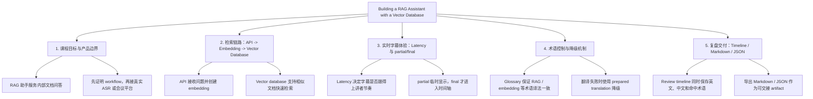

# AI Interpreter Mock Transcript

## Summary
- Stream: Building a RAG Assistant with a Vector Database
- Stream ID: stream_tech_talk_p0_001
- Final segments: 10
- Glossary entries: 10
- Term hits: 13
- Optional revision demo exists: true

## Timeline

| Time | English | Chinese | Term Hits |
|---|---|---|---|
| 00:00-00:04 | Today we are building a RAG assistant for internal documentation. | 今天我们要构建一个面向内部文档的检索增强生成助手。 | RAG -> 检索增强生成 |
| 00:08-00:11 | The API receives a user question and creates an embedding for retrieval. | API 接收用户问题，并为检索创建一个嵌入向量。 | API -> API<br>embedding -> 嵌入向量 |
| 00:16-00:20 | We store the vectors in a vector database so similar documents can be found quickly. | 我们把向量存入向量数据库，以便快速找到相似文档。 | vector database -> 向量数据库 |
| 00:24-00:29 | Latency matters because the subtitle must stay close to the speaker's pace. | 延迟很重要，因为字幕必须尽量贴近讲者节奏。 | Latency -> 延迟 |
| 00:33-00:38 | A glossary keeps key terms such as RAG and embedding translated consistently. | 术语表让 RAG 和嵌入向量等关键术语保持一致译法。 | glossary -> 术语表<br>RAG -> 检索增强生成<br>embedding -> 嵌入向量 |
| 00:42-00:47 | The system marks partial text as unstable and commits only final segments to the timeline. | 系统把临时识别结果标记为不稳定，只把稳定识别结果提交到时间轴。 | partial -> 临时识别结果<br>final -> 稳定识别结果<br>timeline -> 时间轴 |
| 00:51-00:55 | If the translation model fails, the demo can fall back to a prepared translation. | 如果翻译模型失败，演示可以降级使用预置译文。 | - |
| 01:00-01:04 | The review timeline shows the English sentence, Chinese translation, and matched terms. | 复盘时间轴展示英文句子、中文翻译和命中的术语。 | timeline -> 时间轴 |
| 01:09-01:14 | At the end we export the bilingual transcript as Markdown and JSON. | 最后我们把双语 transcript 导出为 Markdown 和 JSON。 | Markdown -> Markdown |
| 01:19-01:24 | This mock stream proves the workflow before we connect any real ASR or meeting platform. | 这条 mock 流用于先证明工作流，再接入真实 ASR 或会议平台。 | - |

## Knowledge Tree

This is P1 mock data. It simulates a floating white-text knowledge tree; it does not prove real LLM generation.

### Architecture Graph



### Growing Code Tree

```text
Building a RAG Assistant with a Vector Database/
├── 1. 课程目标与产品边界/
│   ├── RAG 助手服务内部文档问答/
│   │   ├── core: 课程目标不是泛化聊天，而是围绕内部文档构建可检索的 RAG assistant。
│   │   ├── quote: "Today we are building a RAG assistant for internal documentation."
│   │   └── ref: 00:00-00:04
│   └── 先证明 workflow，再接真实 ASR 或会议平台/
│       ├── core: P0 的价值是证明 workflow 和数据契约，不伪装成真实集成。
│       ├── quote: "This mock stream proves the workflow before we connect any real ASR or meeting platform."
│       └── ref: 01:19-01:24
├── 2. 检索链路：API -> Embedding -> Vector Database/
│   ├── API 接收问题并创建 embedding/
│   │   ├── core: 用户问题先进入 API，再被转换成可检索的 embedding。
│   │   ├── quote: "The API receives a user question and creates an embedding for retrieval."
│   │   └── ref: 00:08-00:11
│   └── Vector database 支持相似文档快速检索/
│       ├── core: 向量数据库保存文档向量，核心价值是快速找到相似文档。
│       ├── quote: "We store the vectors in a vector database so similar documents can be found quickly."
│       └── ref: 00:16-00:20
├── 3. 实时字幕体验：Latency 与 partial/final/
│   ├── Latency 决定字幕是否跟得上讲者节奏/
│   │   ├── core: 实时字幕不是只看准确率，还要接近讲者 pace。
│   │   ├── quote: "Latency matters because the subtitle must stay close to the speaker's pace."
│   │   └── ref: 00:24-00:29
│   └── partial 临时显示，final 才进入时间轴/
│       ├── core: 系统把不稳定识别和稳定识别分开，避免临时字幕污染复盘材料。
│       ├── quote: "The system marks partial text as unstable and commits only final segments to the timeline."
│       └── ref: 00:42-00:47
├── 4. 术语控制与降级机制/
│   ├── Glossary 保证 RAG / embedding 等术语译法一致/
│   │   ├── core: 术语表把关键技术词从模型自由翻译中拉回可控状态。
│   │   ├── quote: "A glossary keeps key terms such as RAG and embedding translated consistently."
│   │   └── ref: 00:33-00:38
│   └── 翻译失败时使用 prepared translation 降级/
│       ├── core: 演示链路必须可复现，模型失败时不能阻塞主流程。
│       ├── quote: "If the translation model fails, the demo can fall back to a prepared translation."
│       └── ref: 00:51-00:55
└── 5. 复盘交付：Timeline / Markdown / JSON/
    ├── Review timeline 同时保存英文、中文和命中术语/
    │   ├── core: 复盘材料必须能回看原句、译文和术语命中，而不是只给摘要。
    │   ├── quote: "The review timeline shows the English sentence, Chinese translation, and matched terms."
    │   └── ref: 01:00-01:04
    └── 导出 Markdown / JSON 作为可交接 artifact/
        ├── core: Markdown 面向人读，JSON 面向后续工具和自动验证。
        ├── quote: "At the end we export the bilingual transcript as Markdown and JSON."
        └── ref: 01:09-01:14
```

### Growth Snapshots

#### 00:00-00:04 - RAG 助手服务内部文档问答

```text
Building a RAG Assistant with a Vector Database/
├── 1. 课程目标与产品边界/
│   └── RAG 助手服务内部文档问答/
│       ├── core: 课程目标不是泛化聊天，而是围绕内部文档构建可检索的 RAG assistant。
│       ├── quote: "Today we are building a RAG assistant for internal documentation."
│       └── ref: 00:00-00:04
├── 2. 检索链路：API -> Embedding -> Vector Database/
├── 3. 实时字幕体验：Latency 与 partial/final/
├── 4. 术语控制与降级机制/
└── 5. 复盘交付：Timeline / Markdown / JSON/
```

#### 00:08-00:11 - API 接收问题并创建 embedding

```text
Building a RAG Assistant with a Vector Database/
├── 1. 课程目标与产品边界/
│   └── RAG 助手服务内部文档问答/
│       ├── core: 课程目标不是泛化聊天，而是围绕内部文档构建可检索的 RAG assistant。
│       ├── quote: "Today we are building a RAG assistant for internal documentation."
│       └── ref: 00:00-00:04
├── 2. 检索链路：API -> Embedding -> Vector Database/
│   └── API 接收问题并创建 embedding/
│       ├── core: 用户问题先进入 API，再被转换成可检索的 embedding。
│       ├── quote: "The API receives a user question and creates an embedding for retrieval."
│       └── ref: 00:08-00:11
├── 3. 实时字幕体验：Latency 与 partial/final/
├── 4. 术语控制与降级机制/
└── 5. 复盘交付：Timeline / Markdown / JSON/
```

#### 00:16-00:20 - Vector database 支持相似文档快速检索

```text
Building a RAG Assistant with a Vector Database/
├── 1. 课程目标与产品边界/
│   └── RAG 助手服务内部文档问答/
│       ├── core: 课程目标不是泛化聊天，而是围绕内部文档构建可检索的 RAG assistant。
│       ├── quote: "Today we are building a RAG assistant for internal documentation."
│       └── ref: 00:00-00:04
├── 2. 检索链路：API -> Embedding -> Vector Database/
│   ├── API 接收问题并创建 embedding/
│   │   ├── core: 用户问题先进入 API，再被转换成可检索的 embedding。
│   │   ├── quote: "The API receives a user question and creates an embedding for retrieval."
│   │   └── ref: 00:08-00:11
│   └── Vector database 支持相似文档快速检索/
│       ├── core: 向量数据库保存文档向量，核心价值是快速找到相似文档。
│       ├── quote: "We store the vectors in a vector database so similar documents can be found quickly."
│       └── ref: 00:16-00:20
├── 3. 实时字幕体验：Latency 与 partial/final/
├── 4. 术语控制与降级机制/
└── 5. 复盘交付：Timeline / Markdown / JSON/
```

#### 00:24-00:29 - Latency 决定字幕是否跟得上讲者节奏

```text
Building a RAG Assistant with a Vector Database/
├── 1. 课程目标与产品边界/
│   └── RAG 助手服务内部文档问答/
│       ├── core: 课程目标不是泛化聊天，而是围绕内部文档构建可检索的 RAG assistant。
│       ├── quote: "Today we are building a RAG assistant for internal documentation."
│       └── ref: 00:00-00:04
├── 2. 检索链路：API -> Embedding -> Vector Database/
│   ├── API 接收问题并创建 embedding/
│   │   ├── core: 用户问题先进入 API，再被转换成可检索的 embedding。
│   │   ├── quote: "The API receives a user question and creates an embedding for retrieval."
│   │   └── ref: 00:08-00:11
│   └── Vector database 支持相似文档快速检索/
│       ├── core: 向量数据库保存文档向量，核心价值是快速找到相似文档。
│       ├── quote: "We store the vectors in a vector database so similar documents can be found quickly."
│       └── ref: 00:16-00:20
├── 3. 实时字幕体验：Latency 与 partial/final/
│   └── Latency 决定字幕是否跟得上讲者节奏/
│       ├── core: 实时字幕不是只看准确率，还要接近讲者 pace。
│       ├── quote: "Latency matters because the subtitle must stay close to the speaker's pace."
│       └── ref: 00:24-00:29
├── 4. 术语控制与降级机制/
└── 5. 复盘交付：Timeline / Markdown / JSON/
```

#### 00:33-00:38 - Glossary 保证 RAG / embedding 等术语译法一致

```text
Building a RAG Assistant with a Vector Database/
├── 1. 课程目标与产品边界/
│   └── RAG 助手服务内部文档问答/
│       ├── core: 课程目标不是泛化聊天，而是围绕内部文档构建可检索的 RAG assistant。
│       ├── quote: "Today we are building a RAG assistant for internal documentation."
│       └── ref: 00:00-00:04
├── 2. 检索链路：API -> Embedding -> Vector Database/
│   ├── API 接收问题并创建 embedding/
│   │   ├── core: 用户问题先进入 API，再被转换成可检索的 embedding。
│   │   ├── quote: "The API receives a user question and creates an embedding for retrieval."
│   │   └── ref: 00:08-00:11
│   └── Vector database 支持相似文档快速检索/
│       ├── core: 向量数据库保存文档向量，核心价值是快速找到相似文档。
│       ├── quote: "We store the vectors in a vector database so similar documents can be found quickly."
│       └── ref: 00:16-00:20
├── 3. 实时字幕体验：Latency 与 partial/final/
│   └── Latency 决定字幕是否跟得上讲者节奏/
│       ├── core: 实时字幕不是只看准确率，还要接近讲者 pace。
│       ├── quote: "Latency matters because the subtitle must stay close to the speaker's pace."
│       └── ref: 00:24-00:29
├── 4. 术语控制与降级机制/
│   └── Glossary 保证 RAG / embedding 等术语译法一致/
│       ├── core: 术语表把关键技术词从模型自由翻译中拉回可控状态。
│       ├── quote: "A glossary keeps key terms such as RAG and embedding translated consistently."
│       └── ref: 00:33-00:38
└── 5. 复盘交付：Timeline / Markdown / JSON/
```

#### 00:42-00:47 - partial 临时显示，final 才进入时间轴

```text
Building a RAG Assistant with a Vector Database/
├── 1. 课程目标与产品边界/
│   └── RAG 助手服务内部文档问答/
│       ├── core: 课程目标不是泛化聊天，而是围绕内部文档构建可检索的 RAG assistant。
│       ├── quote: "Today we are building a RAG assistant for internal documentation."
│       └── ref: 00:00-00:04
├── 2. 检索链路：API -> Embedding -> Vector Database/
│   ├── API 接收问题并创建 embedding/
│   │   ├── core: 用户问题先进入 API，再被转换成可检索的 embedding。
│   │   ├── quote: "The API receives a user question and creates an embedding for retrieval."
│   │   └── ref: 00:08-00:11
│   └── Vector database 支持相似文档快速检索/
│       ├── core: 向量数据库保存文档向量，核心价值是快速找到相似文档。
│       ├── quote: "We store the vectors in a vector database so similar documents can be found quickly."
│       └── ref: 00:16-00:20
├── 3. 实时字幕体验：Latency 与 partial/final/
│   ├── Latency 决定字幕是否跟得上讲者节奏/
│   │   ├── core: 实时字幕不是只看准确率，还要接近讲者 pace。
│   │   ├── quote: "Latency matters because the subtitle must stay close to the speaker's pace."
│   │   └── ref: 00:24-00:29
│   └── partial 临时显示，final 才进入时间轴/
│       ├── core: 系统把不稳定识别和稳定识别分开，避免临时字幕污染复盘材料。
│       ├── quote: "The system marks partial text as unstable and commits only final segments to the timeline."
│       └── ref: 00:42-00:47
├── 4. 术语控制与降级机制/
│   └── Glossary 保证 RAG / embedding 等术语译法一致/
│       ├── core: 术语表把关键技术词从模型自由翻译中拉回可控状态。
│       ├── quote: "A glossary keeps key terms such as RAG and embedding translated consistently."
│       └── ref: 00:33-00:38
└── 5. 复盘交付：Timeline / Markdown / JSON/
```

#### 00:51-00:55 - 翻译失败时使用 prepared translation 降级

```text
Building a RAG Assistant with a Vector Database/
├── 1. 课程目标与产品边界/
│   └── RAG 助手服务内部文档问答/
│       ├── core: 课程目标不是泛化聊天，而是围绕内部文档构建可检索的 RAG assistant。
│       ├── quote: "Today we are building a RAG assistant for internal documentation."
│       └── ref: 00:00-00:04
├── 2. 检索链路：API -> Embedding -> Vector Database/
│   ├── API 接收问题并创建 embedding/
│   │   ├── core: 用户问题先进入 API，再被转换成可检索的 embedding。
│   │   ├── quote: "The API receives a user question and creates an embedding for retrieval."
│   │   └── ref: 00:08-00:11
│   └── Vector database 支持相似文档快速检索/
│       ├── core: 向量数据库保存文档向量，核心价值是快速找到相似文档。
│       ├── quote: "We store the vectors in a vector database so similar documents can be found quickly."
│       └── ref: 00:16-00:20
├── 3. 实时字幕体验：Latency 与 partial/final/
│   ├── Latency 决定字幕是否跟得上讲者节奏/
│   │   ├── core: 实时字幕不是只看准确率，还要接近讲者 pace。
│   │   ├── quote: "Latency matters because the subtitle must stay close to the speaker's pace."
│   │   └── ref: 00:24-00:29
│   └── partial 临时显示，final 才进入时间轴/
│       ├── core: 系统把不稳定识别和稳定识别分开，避免临时字幕污染复盘材料。
│       ├── quote: "The system marks partial text as unstable and commits only final segments to the timeline."
│       └── ref: 00:42-00:47
├── 4. 术语控制与降级机制/
│   ├── Glossary 保证 RAG / embedding 等术语译法一致/
│   │   ├── core: 术语表把关键技术词从模型自由翻译中拉回可控状态。
│   │   ├── quote: "A glossary keeps key terms such as RAG and embedding translated consistently."
│   │   └── ref: 00:33-00:38
│   └── 翻译失败时使用 prepared translation 降级/
│       ├── core: 演示链路必须可复现，模型失败时不能阻塞主流程。
│       ├── quote: "If the translation model fails, the demo can fall back to a prepared translation."
│       └── ref: 00:51-00:55
└── 5. 复盘交付：Timeline / Markdown / JSON/
```

#### 01:00-01:04 - Review timeline 同时保存英文、中文和命中术语

```text
Building a RAG Assistant with a Vector Database/
├── 1. 课程目标与产品边界/
│   └── RAG 助手服务内部文档问答/
│       ├── core: 课程目标不是泛化聊天，而是围绕内部文档构建可检索的 RAG assistant。
│       ├── quote: "Today we are building a RAG assistant for internal documentation."
│       └── ref: 00:00-00:04
├── 2. 检索链路：API -> Embedding -> Vector Database/
│   ├── API 接收问题并创建 embedding/
│   │   ├── core: 用户问题先进入 API，再被转换成可检索的 embedding。
│   │   ├── quote: "The API receives a user question and creates an embedding for retrieval."
│   │   └── ref: 00:08-00:11
│   └── Vector database 支持相似文档快速检索/
│       ├── core: 向量数据库保存文档向量，核心价值是快速找到相似文档。
│       ├── quote: "We store the vectors in a vector database so similar documents can be found quickly."
│       └── ref: 00:16-00:20
├── 3. 实时字幕体验：Latency 与 partial/final/
│   ├── Latency 决定字幕是否跟得上讲者节奏/
│   │   ├── core: 实时字幕不是只看准确率，还要接近讲者 pace。
│   │   ├── quote: "Latency matters because the subtitle must stay close to the speaker's pace."
│   │   └── ref: 00:24-00:29
│   └── partial 临时显示，final 才进入时间轴/
│       ├── core: 系统把不稳定识别和稳定识别分开，避免临时字幕污染复盘材料。
│       ├── quote: "The system marks partial text as unstable and commits only final segments to the timeline."
│       └── ref: 00:42-00:47
├── 4. 术语控制与降级机制/
│   ├── Glossary 保证 RAG / embedding 等术语译法一致/
│   │   ├── core: 术语表把关键技术词从模型自由翻译中拉回可控状态。
│   │   ├── quote: "A glossary keeps key terms such as RAG and embedding translated consistently."
│   │   └── ref: 00:33-00:38
│   └── 翻译失败时使用 prepared translation 降级/
│       ├── core: 演示链路必须可复现，模型失败时不能阻塞主流程。
│       ├── quote: "If the translation model fails, the demo can fall back to a prepared translation."
│       └── ref: 00:51-00:55
└── 5. 复盘交付：Timeline / Markdown / JSON/
    └── Review timeline 同时保存英文、中文和命中术语/
        ├── core: 复盘材料必须能回看原句、译文和术语命中，而不是只给摘要。
        ├── quote: "The review timeline shows the English sentence, Chinese translation, and matched terms."
        └── ref: 01:00-01:04
```

#### 01:09-01:14 - 导出 Markdown / JSON 作为可交接 artifact

```text
Building a RAG Assistant with a Vector Database/
├── 1. 课程目标与产品边界/
│   └── RAG 助手服务内部文档问答/
│       ├── core: 课程目标不是泛化聊天，而是围绕内部文档构建可检索的 RAG assistant。
│       ├── quote: "Today we are building a RAG assistant for internal documentation."
│       └── ref: 00:00-00:04
├── 2. 检索链路：API -> Embedding -> Vector Database/
│   ├── API 接收问题并创建 embedding/
│   │   ├── core: 用户问题先进入 API，再被转换成可检索的 embedding。
│   │   ├── quote: "The API receives a user question and creates an embedding for retrieval."
│   │   └── ref: 00:08-00:11
│   └── Vector database 支持相似文档快速检索/
│       ├── core: 向量数据库保存文档向量，核心价值是快速找到相似文档。
│       ├── quote: "We store the vectors in a vector database so similar documents can be found quickly."
│       └── ref: 00:16-00:20
├── 3. 实时字幕体验：Latency 与 partial/final/
│   ├── Latency 决定字幕是否跟得上讲者节奏/
│   │   ├── core: 实时字幕不是只看准确率，还要接近讲者 pace。
│   │   ├── quote: "Latency matters because the subtitle must stay close to the speaker's pace."
│   │   └── ref: 00:24-00:29
│   └── partial 临时显示，final 才进入时间轴/
│       ├── core: 系统把不稳定识别和稳定识别分开，避免临时字幕污染复盘材料。
│       ├── quote: "The system marks partial text as unstable and commits only final segments to the timeline."
│       └── ref: 00:42-00:47
├── 4. 术语控制与降级机制/
│   ├── Glossary 保证 RAG / embedding 等术语译法一致/
│   │   ├── core: 术语表把关键技术词从模型自由翻译中拉回可控状态。
│   │   ├── quote: "A glossary keeps key terms such as RAG and embedding translated consistently."
│   │   └── ref: 00:33-00:38
│   └── 翻译失败时使用 prepared translation 降级/
│       ├── core: 演示链路必须可复现，模型失败时不能阻塞主流程。
│       ├── quote: "If the translation model fails, the demo can fall back to a prepared translation."
│       └── ref: 00:51-00:55
└── 5. 复盘交付：Timeline / Markdown / JSON/
    ├── Review timeline 同时保存英文、中文和命中术语/
    │   ├── core: 复盘材料必须能回看原句、译文和术语命中，而不是只给摘要。
    │   ├── quote: "The review timeline shows the English sentence, Chinese translation, and matched terms."
    │   └── ref: 01:00-01:04
    └── 导出 Markdown / JSON 作为可交接 artifact/
        ├── core: Markdown 面向人读，JSON 面向后续工具和自动验证。
        ├── quote: "At the end we export the bilingual transcript as Markdown and JSON."
        └── ref: 01:09-01:14
```

#### 01:19-01:24 - 先证明 workflow，再接真实 ASR 或会议平台

```text
Building a RAG Assistant with a Vector Database/
├── 1. 课程目标与产品边界/
│   ├── RAG 助手服务内部文档问答/
│   │   ├── core: 课程目标不是泛化聊天，而是围绕内部文档构建可检索的 RAG assistant。
│   │   ├── quote: "Today we are building a RAG assistant for internal documentation."
│   │   └── ref: 00:00-00:04
│   └── 先证明 workflow，再接真实 ASR 或会议平台/
│       ├── core: P0 的价值是证明 workflow 和数据契约，不伪装成真实集成。
│       ├── quote: "This mock stream proves the workflow before we connect any real ASR or meeting platform."
│       └── ref: 01:19-01:24
├── 2. 检索链路：API -> Embedding -> Vector Database/
│   ├── API 接收问题并创建 embedding/
│   │   ├── core: 用户问题先进入 API，再被转换成可检索的 embedding。
│   │   ├── quote: "The API receives a user question and creates an embedding for retrieval."
│   │   └── ref: 00:08-00:11
│   └── Vector database 支持相似文档快速检索/
│       ├── core: 向量数据库保存文档向量，核心价值是快速找到相似文档。
│       ├── quote: "We store the vectors in a vector database so similar documents can be found quickly."
│       └── ref: 00:16-00:20
├── 3. 实时字幕体验：Latency 与 partial/final/
│   ├── Latency 决定字幕是否跟得上讲者节奏/
│   │   ├── core: 实时字幕不是只看准确率，还要接近讲者 pace。
│   │   ├── quote: "Latency matters because the subtitle must stay close to the speaker's pace."
│   │   └── ref: 00:24-00:29
│   └── partial 临时显示，final 才进入时间轴/
│       ├── core: 系统把不稳定识别和稳定识别分开，避免临时字幕污染复盘材料。
│       ├── quote: "The system marks partial text as unstable and commits only final segments to the timeline."
│       └── ref: 00:42-00:47
├── 4. 术语控制与降级机制/
│   ├── Glossary 保证 RAG / embedding 等术语译法一致/
│   │   ├── core: 术语表把关键技术词从模型自由翻译中拉回可控状态。
│   │   ├── quote: "A glossary keeps key terms such as RAG and embedding translated consistently."
│   │   └── ref: 00:33-00:38
│   └── 翻译失败时使用 prepared translation 降级/
│       ├── core: 演示链路必须可复现，模型失败时不能阻塞主流程。
│       ├── quote: "If the translation model fails, the demo can fall back to a prepared translation."
│       └── ref: 00:51-00:55
└── 5. 复盘交付：Timeline / Markdown / JSON/
    ├── Review timeline 同时保存英文、中文和命中术语/
    │   ├── core: 复盘材料必须能回看原句、译文和术语命中，而不是只给摘要。
    │   ├── quote: "The review timeline shows the English sentence, Chinese translation, and matched terms."
    │   └── ref: 01:00-01:04
    └── 导出 Markdown / JSON 作为可交接 artifact/
        ├── core: Markdown 面向人读，JSON 面向后续工具和自动验证。
        ├── quote: "At the end we export the bilingual transcript as Markdown and JSON."
        └── ref: 01:09-01:14
```


## Fallback Notes
- fallback_asr_prepared_stream: ASR unavailable. Using prepared partial/final event stream for this demo.
- fallback_translation_prepared_text: Translation adapter unavailable. Using prepared Chinese translations.
- fallback_export_copy_text: Export failed. Copyable bilingual timeline is available on the page.
- fallback_builtin_glossary: Term import failed. Built-in technical glossary is active.

P2 revision demo data is optional and is not included in the main timeline.
